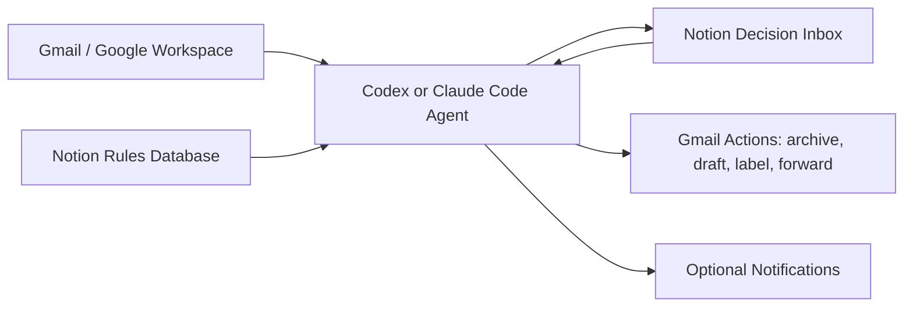

# Architecture

## Components



## Core Loop

1. Read active Notion rules.
2. Scan configured Gmail inboxes.
3. Classify each thread.
4. Archive clear noise.
5. Reply with the configured feedback portal for routine bug reports and feature requests when that is the whole ask.
6. Create or update Notion decision items for true signal.
7. Notify only when the rule calls for it.
8. Process Notion comments/status changes.
9. Draft, delegate, archive, or close as instructed.

## Two-Speed Automation

Use two separate runs:

- Full triage: checks Gmail and creates/updates Notion items.
- Response checker: checks Notion for comments/status changes and acts faster.

This prevents every mobile response from waiting for a full inbox scan.

## Triage IDs

Every decision item gets a stable ID:

```text
SOURCE-ABCDE
```

Examples:

```text
CEO@PERSONAL-ALPHA
CEO@COMPANY-BRAVO
```

Use uppercase letter-only item codes so they are easy to dictate and search.
